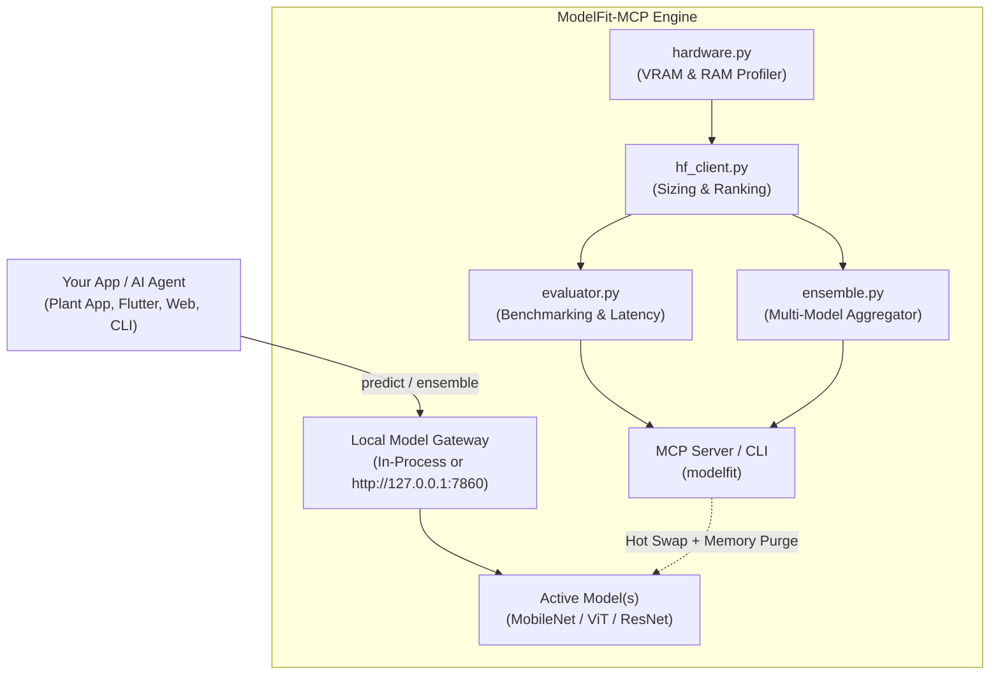

# ModelFit-MCP

[](https://github.com/DumboDhruvi/ModelFit-MCP/actions/workflows/ci.yml)
[](https://www.python.org/)
[](https://opensource.org/licenses/MIT)
[](https://modelcontextprotocol.io/)

> **Hardware-Aware Hugging Face Discovery, Memory Fitting, Empirical Benchmarking & Swappable Local Model Gateway for AI Agents.**

ModelFit-MCP connects AI agents (Claude Desktop, Cursor, custom autonomous agents) to Hugging Face with built-in hardware awareness. It profiles host specs (CPU, RAM, GPU, VRAM), calculates exact model memory footprints, filters out models that would trigger CUDA Out of Memory (OOM) errors, and spins up a **swappable local gateway** so models can be changed dynamically without modifying application code.

---

## Key Features
- **Zero OOM Crashes**: Automatically evaluates parameter count, precision (`fp32`, `fp16`, `int8`, `int4`), and 25% activation headroom before suggesting or loading models.
- **Empirical Accuracy & Latency Benchmarking**: Automatically runs test evaluations across candidate models that satisfy hardware specs to rank them by real-world inference speed and confidence.
- **High-Speed Ensembles**: Discovers ultra-lightweight models that consume $\le 35\%$ of hardware headroom and aggregates them via `weighted_average`, `majority_vote`, or `top_confidence` strategies.
- **Swappable Architecture**: Your client code interacts with an abstract gateway (`gateway.predict()` or `POST /predict`). Models can be upgraded or hot-swapped without touching your application code.
- **Memory Purging**: Unloads old weights and triggers `torch.cuda.empty_cache()` on every swap to prevent VRAM memory leaks.
- **Multi-Modal**: Normalizes outputs across `image-classification`, `object-detection`, `text-generation`, and `zero-shot-image-classification`.
- **Cross-Language Ready**: First-class support for Python, Flutter/Dart, Node.js, and cURL.

---

## System Architecture



---

## Quickstart

### 1. Installation
```bash
git clone https://github.com/DumboDhruvi/ModelFit-MCP.git
cd ModelFit-MCP
pip install -e .
```

### 2. CLI Usage

Inspect your hardware headroom:
```bash
modelfit specs
```

Search Hugging Face models guaranteed to fit your machine:
```bash
modelfit search "plant disease" --task image-classification
```

Benchmark multiple candidate models on your hardware:
```bash
modelfit benchmark "nateraw/food,google/vit-base-patch16-224" --samples "sample1.jpg,sample2.jpg"
```

Run ensemble inference across lightweight models:
```bash
modelfit ensemble "model-a,model-b" --input "sample.jpg" --strategy weighted_average
```

Start the local micro-API daemon:
```bash
modelfit serve --port 7860
```

Hot-swap models on the fly:
```bash
modelfit swap "google/vit-base-patch16-224" --task image-classification
```

---

## MCP Server Tools (Claude Desktop & Cursor)

Add ModelFit to your `claude_desktop_config.json`:

```json
{
  "mcpServers": {
    "modelfit": {
      "command": "modelfit-server"
    }
  }
}
```

### Available MCP Tools:
| Tool | Description |
| :--- | :--- |
| `get_hardware_specs` | Detect host CPU, RAM, and GPU/VRAM headroom. |
| `search_compatible_models` | Search Hugging Face models strictly filtered by hardware fit. |
| `recommend_and_scaffold` | 1-shot model search, hardware check, and code scaffolding. |
| `benchmark_models` | Run live accuracy and latency benchmarking on candidate models. |
| `find_ensemble_models` | Find ultra-fast models suitable for low-latency ensembling. |
| `ensemble_predict` | Execute ensemble prediction combining multiple models. |
| `swap_active_model` | Hot-swap the active model with VRAM-safe memory purging. |
| `get_active_model_status` | Inspect currently loaded model and target device. |
| `get_integration_code` | Get drop-in Python inference code. |

---

## Integration Modes

### Mode A: In-Process Python Adapter (Zero Latency)
```python
from modelfit.adapter import gateway

# 1. Load initial model
gateway.load_model("linkanjarad/mobilenet_v2_1.0_224-plant-disease-identification")

# 2. Abstract prediction
results = gateway.predict("leaf.jpg")
print(results[0].label, results[0].score)

# 3. Hot-swap later with ZERO code changes below
gateway.load_model("google/vit-base-patch16-224")
results = gateway.predict("leaf.jpg")
```

### Mode B: High-Speed Ensemble Inference
```python
from modelfit.ensemble import EnsembleGateway

ensemble = EnsembleGateway()
candidates = ensemble.find_ensemble_candidates("plant disease", max_models=3)
model_ids = [m["model_id"] for m in candidates]

predictions = ensemble.predict_ensemble(
    input_data="leaf.jpg",
    model_ids=model_ids,
    strategy="weighted_average"
)

for p in predictions:
    print(f"{p.label}: {p.score:.2f} (votes: {p.votes})")
```

### Mode C: Local Micro-API (Flutter, Node.js, Web, cURL)
Start the background daemon:
```bash
modelfit serve --port 7860
```

Query or swap over HTTP:
```bash
# Predict
curl -X POST http://127.0.0.1:7860/predict \
  -H "Content-Type: application/json" \
  -d '{"input": "leaf_sample.jpg"}'

# Hot-Swap
curl -X POST http://127.0.0.1:7860/swap \
  -H "Content-Type: application/json" \
  -d '{"model_id": "google/vit-base-patch16-224", "task": "image-classification"}'
```

*See [`examples/flutter_integration_example.dart`](examples/flutter_integration_example.dart) for a complete Flutter service.*

---

## Testing

Run the full test suite:
```bash
python3 -m unittest discover tests -v
```
*All tests complete in under 2 seconds.*

---

## License
MIT License. See `LICENSE` for details.
