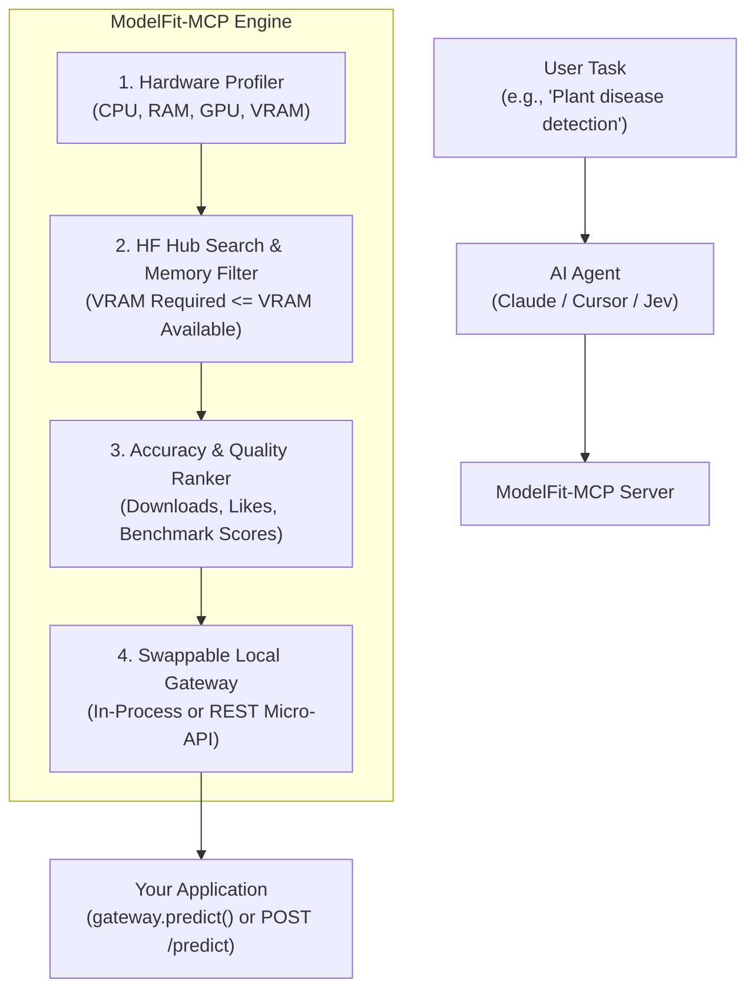

# ModelFit-MCP

[](https://www.python.org/)
[](https://opensource.org/licenses/MIT)
[](https://modelcontextprotocol.io/)

> **Hardware-Aware Hugging Face Discovery, Memory Fitting, & Swappable Local Model Gateway for AI Agents.**

ModelFit-MCP connects AI agents (Claude Desktop, Cursor, custom autonomous agents) to Hugging Face with built-in hardware awareness. It profiles host specs (CPU, RAM, GPU, VRAM), calculates exact model memory footprints, filters out models that would trigger CUDA Out of Memory (OOM) errors, and spins up a **swappable local gateway** so models can be changed dynamically without modifying application code.

---

## The Problem
When AI agents recommend open-source models for tasks like plant detection or image classification, they typically query the Hugging Face Hub blindly. This results in:
1. **CUDA Out of Memory (OOM) crashes**: Recommending models too large for the user's VRAM.
2. **Brittle Code Coupling**: Hardcoding specific model weights, tokenizers, and pipelines into application code.
3. **No Hot-Swapping**: Upgrading or testing an alternative model requires rewriting inference code.

---

## The Solution: ModelFit-MCP



---

## Quickstart

### 1. Installation
```bash
git clone https://github.com/DumboDhruvi/ModelFit-MCP.git
cd ModelFit-MCP
pip install -e .
```

### 2. Configure with your MCP Client

Add ModelFit-MCP to your `claude_desktop_config.json` or Cursor MCP settings:

```json
{
  "mcpServers": {
    "modelfit": {
      "command": "python3",
      "args": ["-m", "modelfit.server"]
    }
  }
}
```

---

## Integration Modes

### Mode A: In-Process Python Adapter (Zero Latency)
Import [`gateway`](file:///home/dumbo/some_project/src/modelfit/adapter.py) directly into your Python application:

```python
from modelfit.adapter import gateway

# 1. Load model (or let the MCP agent do this)
gateway.load_model("linkanjarad/mobilenet_v2_1.0_224-plant-disease-identification")

# 2. Abstract prediction (your app code only cares about inputs and outputs)
results = gateway.predict("plant_leaf.jpg")
print(f"Prediction: {results[0].label} ({results[0].score * 100:.1f}%)")

# 3. Hot-swap later with ZERO changes to your prediction code
gateway.load_model("google/vit-base-patch16-224")
results = gateway.predict("plant_leaf.jpg")
```

### Mode B: Local Micro-API (Cross-Language: Flutter, Node.js, Go, cURL)
Start the lightweight background daemon:
```bash
python3 -m modelfit.local_api --port 7860
```

Query or swap models over HTTP:
```bash
# Predict
curl -X POST http://127.0.0.1:7860/predict \
  -H "Content-Type: application/json" \
  -d '{"input": "leaf_sample.jpg"}'

# Hot-Swap Model
curl -X POST http://127.0.0.1:7860/swap \
  -H "Content-Type: application/json" \
  -d '{"model_id": "google/vit-base-patch16-224", "task": "image-classification"}'

# Check Status
curl http://127.0.0.1:7860/status
```

---

## Testing

Run the complete test suite:
```bash
python3 -m unittest discover tests
```
*All tests use mocked network calls and lightweight mocks, completing in under 2 seconds.*

---

## License
MIT License. See `LICENSE` for details.
